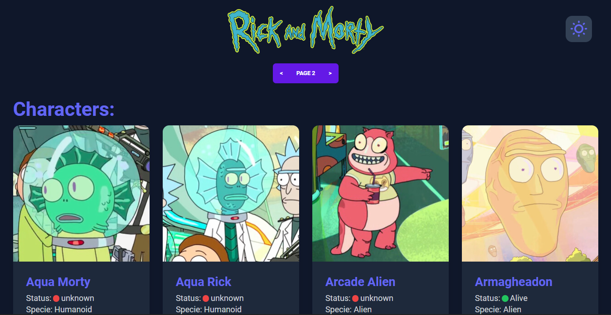

# Rick and Morty

Rick and Morty website build with React, Tailwind CSS, DaisyUI, ViteJS and use the Rick and Morty API for all of the data.
The website have dark mode. 

## Screenshot


## Installation
Clone project 
```
  git clone https://github.com/Brayanro/rick-and-morty.git
```

Install dependencies
```
  yarn install or npm install
```

Run proyect in development
```
  yarn dev or npm run dev
```